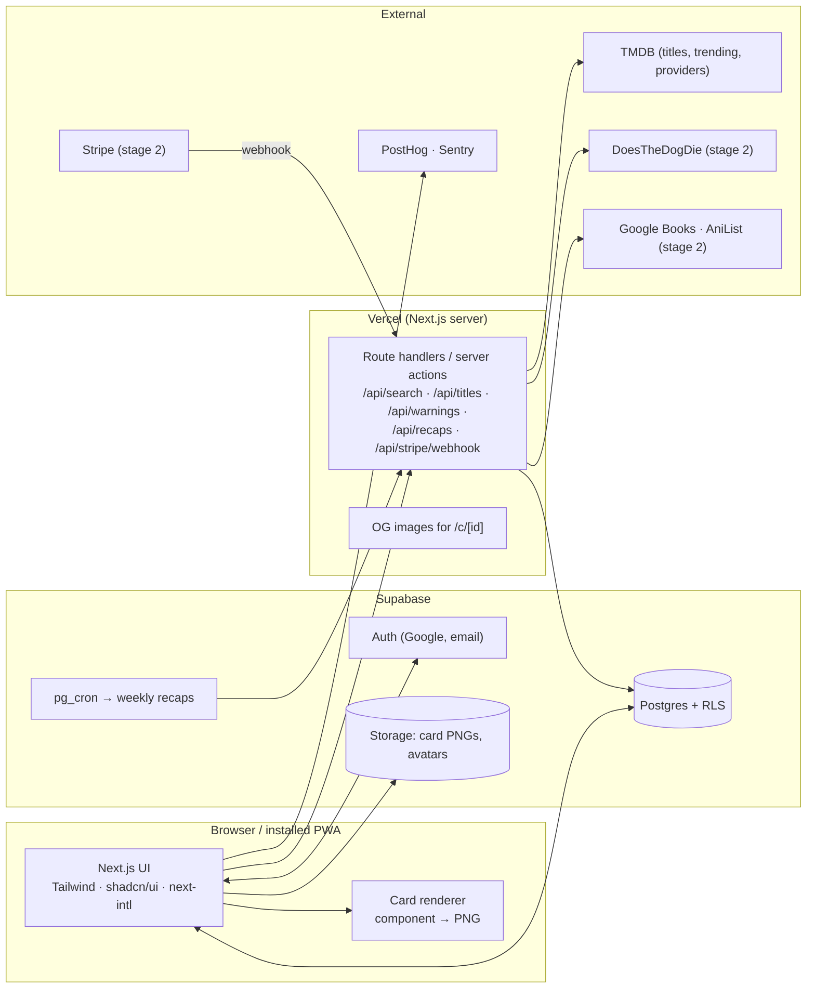

# Architecture overview

Solo-founder sized: **one Next.js app + Supabase**. Other services are added only when an [expansion gate](../roadmap.md#expansion-gates) requires them. Decision: [ADR 0006](../decisions/0006-single-nextjs-app.md).

## System diagram

## Code layout (single app)

| Path | Contains | Rule |
|---|---|---|
| `src/app/[locale]/...` | Pages (App Router), layouts | UI only. Call into `src/core` / `src/data`. |
| `src/app/api/...` | Route handlers (search proxy, warnings, recaps, webhooks) | Hold all external API keys. |
| `src/components/` | Shared UI components (shadcn, primitives in `ui/`) | – |
| `src/lib/` | Small UI helpers (`cn`) | No domain logic. That goes in `src/core`. |
| `src/cards/` | Card templates + renderer (`templates/*`, `render.ts`) | Templates are self-registering components + metadata. |
| `src/core/` | **Pure TypeScript:** domain types, zod schemas, catalog normalizers, stats, formatting, import parsers | **No React, Next, DOM or Supabase imports.** Unit-tested. Extracted into a package when the Expo app comes. |
| `src/data/` | Supabase clients (browser/server), typed queries, snake_case ↔ camelCase mapping | No React. |
| `messages/` | next-intl translation files (`en.json` default, `th.json`) | Every UI string lives here. |
| `supabase/migrations/` | SQL schema, RLS, triggers, seeds | Source of truth for the schema. |

## Where logic lives

| Logic | Location |
|---|---|
| Stats, summaries, runtime formatting, recap computation | `src/core` (pure, tested) |
| Reading/writing the user's own data | `src/data` → Supabase with RLS (from browser or server) |
| External APIs (TMDB, DTDD, Google Books, AniList) | Route handlers only, normalized by `src/core/catalog`, cached in Postgres |
| Card rendering | Browser ([ADR 0008](../decisions/0008-client-side-card-rendering.md)) |
| Scheduled work (weekly recaps, cache refresh) | `pg_cron` → authenticated route handler (upgrade to Trigger.dev when needed) |
| Payments / entitlements | Stripe webhook route handler → `subscriptions` |

## Day-one rules
1. RLS on every table. Server-only tables have no client write policies.
2. User rows use client-generated UUID v7, server-stamped `updated_at` and soft delete (`deleted_at`), so offline sync can be added later ([offline-sync](offline-sync.md)).
3. Timestamps are stored in UTC and displayed in the user's time zone ([i18n](i18n.md)).
4. External data is attributed as its terms require (TMDB, JustWatch, DTDD).
5. Anything money- or reward-related is decided on the server ([ADR 0003](../decisions/0003-server-authoritative-economy.md), relevant from stage 2 Pro onward).

## Environments
Local: `supabase start` + `pnpm dev`. Preview: Vercel preview per PR. Production: Vercel (`inatbalthazars-projects`) + Supabase project. Env var names: [`.env.example`](../../.env.example).
